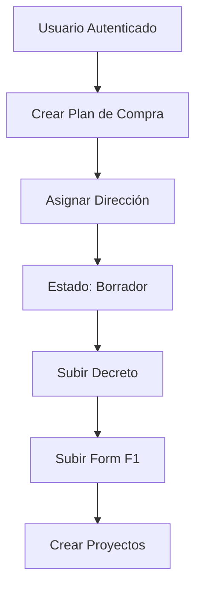
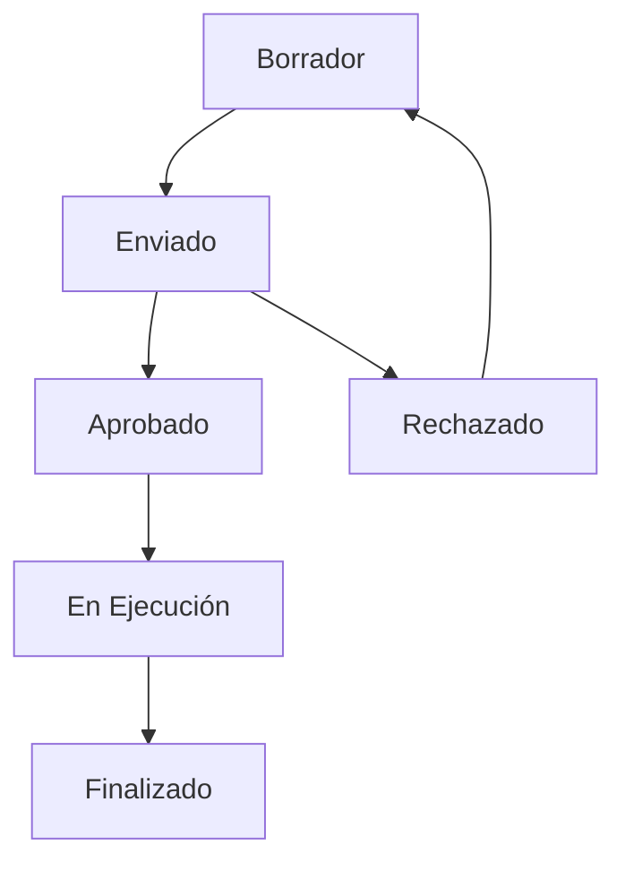

# Análisis Completo del Proyecto - Módulo de Planes de Compra

## 📋 Resumen Ejecutivo

El proyecto es un sistema de gestión de planes de compra municipal desarrollado en Laravel 10, diseñado para manejar el ciclo completo de planificación, ejecución y seguimiento de compras públicas. El sistema implementa un modelo de roles y permisos granular, con validaciones específicas por dirección y jerarquía organizacional.

---

## 🏗️ Arquitectura del Sistema

### **Tecnologías Utilizadas**
- **Backend:** Laravel 10 (PHP 8.1+)
- **Base de Datos:** MySQL/PostgreSQL
- **Autenticación:** Laravel Sanctum + Sesiones
- **Roles y Permisos:** Spatie Laravel Permission
- **Validación:** Reglas personalizadas (RUT chileno)
- **Archivos:** Sistema de almacenamiento con URLs públicas
- **Logs:** Sistema de auditoría completo

### **Patrones de Diseño**
- **Service Layer:** Lógica de negocio en servicios
- **Resource Layer:** Transformación de datos para API
- **Repository Pattern:** Acceso a datos a través de modelos
- **Observer Pattern:** Logs automáticos de actividades
- **Middleware Pattern:** Validaciones de acceso y permisos

---

## 📊 Estructura de Datos - Planes de Compra

### **Modelo Principal: PurchasePlan**

```php
// Campos principales
- id: Identificador único
- name: Nombre del plan de compra
- token: Token único para acceso externo
- year: Año del plan de compra
- direction_id: Dirección municipal responsable
- decreto_id: Archivo del decreto aprobatorio
- form_f1_id: Formulario F1 (presupuesto)
- created_by/updated_by: Usuarios responsables
```

### **Relaciones Clave**
- **Direction:** Plan pertenece a una dirección municipal
- **Projects:** Plan contiene múltiples proyectos
- **Statuses:** Historial de estados del plan
- **Files:** Decretos y formularios asociados
- **Users:** Creadores y modificadores

### **Estados del Plan de Compra**
1. **Borrador** (ID: 1) - Estado inicial
2. **Enviado** (ID: 2) - Enviado para revisión
3. **Aprobado** (ID: 3) - Aprobado por autoridad
4. **Rechazado** (ID: 4) - Rechazado con observaciones
5. **En Ejecución** (ID: 5) - Plan en proceso
6. **Finalizado** (ID: 6) - Plan completado

---

## 🔄 Flujo de Trabajo del Plan de Compra

### **1. Creación del Plan**


### **2. Gestión de Estados**


### **3. Jerarquía de Aprobación**
- **Director:** Crea y gestiona plan de su dirección
- **Administrador Municipal:** Revisa y aprueba planes
- **Secretaría Comunal:** Supervisa proceso general
- **Sistema:** Crea planes automáticamente

---

## 🛡️ Sistema de Seguridad y Permisos

### **Roles Implementados**
1. **Administrador del Sistema** - Acceso total
2. **Administrador Municipal** - Gestión municipal
3. **Secretaría Comunal de Planificación** - Supervisión
4. **Director** - Gestión de su dirección
5. **Subrogante de Director** - Funciones de director
6. **Jefatura** - Gestión de equipos
7. **Subrogante de Jefatura** - Funciones de jefatura
8. **Visador** - Revisión y aprobación

### **Permisos Granulares**
- **purchase_plans.list** - Ver planes de compra
- **purchase_plans.create** - Crear planes
- **purchase_plans.edit** - Editar planes
- **purchase_plans.approve** - Aprobar planes
- **purchase_plans.reject** - Rechazar planes
- **purchase_plans.send** - Enviar para revisión
- **purchase_plans.export** - Exportar datos

### **Validaciones por Dirección**
- **Usuarios jerárquicos:** Solo pueden acceder a su dirección
- **Administradores:** Pueden acceder a múltiples direcciones
- **Middleware personalizado:** Valida acceso por dirección

---

## 📁 Gestión de Archivos

### **Tipos de Archivos**
1. **Decretos:** Documentos oficiales de aprobación
2. **Formularios F1:** Presupuestos detallados
3. **Archivos de Proyectos:** Documentación específica
4. **Archivos de Verificación:** Evidencias de ejecución

### **Almacenamiento**
- **Disco:** Sistema de archivos público
- **URLs:** Acceso directo vía HTTP
- **Organización:** Por tipo y fecha
- **Seguridad:** Validación de tipos MIME

---

## 📈 Funcionalidades Avanzadas

### **1. Creación Automática de Planes**
```php
// Comando automático
php artisan purchase-plans:create-annual

// Programación: 1 de junio de cada año
// Crea planes para todas las direcciones
// Asigna estado inicial (Borrador)
```

### **2. Cálculo de Presupuestos**
```php
// Presupuesto disponible
$availableBudget = $formF1Amount - $totalProjectsAmount;

// Porcentaje de ejecución
$executionPercentage = ($executedAmount / $totalAmount) * 100;
```

### **3. Historial Completo**
- **Estados:** Historial de cambios de estado
- **Movimientos:** Log de todas las acciones
- **Archivos:** Trazabilidad de documentos
- **Usuarios:** Auditoría de responsabilidades

### **4. Exportación de Datos**
- **Planes de compra:** Excel con detalles completos
- **Proyectos:** Listado con estados y montos
- **Items:** Detalle de productos/servicios
- **Historial:** Reportes de auditoría

---

## 🔧 API RESTful

### **Endpoints Principales**

#### **Planes de Compra**
```http
GET    /api/purchase-plans                    # Listar planes
POST   /api/purchase-plans                    # Crear plan
GET    /api/purchase-plans/{id}               # Ver plan específico
PUT    /api/purchase-plans/{id}               # Actualizar plan
DELETE /api/purchase-plans/{id}               # Eliminar plan
GET    /api/purchase-plans/year/{year}        # Plan por año y dirección
```

#### **Estados y Flujo**
```http
POST   /api/purchase-plans/{token}/send       # Enviar plan
PUT    /api/purchase-plans/status/{id}        # Cambiar estado
GET    /api/purchase-plans/{id}/status-history # Historial de estados
GET    /api/purchase-plans/{id}/current-status # Estado actual
```

#### **Archivos**
```http
POST   /api/purchase-plans/upload/decreto     # Subir decreto
POST   /api/purchase-plans/upload/form-f1     # Subir Form F1
GET    /api/files/{id}/download               # Descargar archivo
```

### **Respuestas Estructuradas**
```json
{
  "data": {
    "id": 1,
    "name": "Plan de Compra 2024 - Alcaldía",
    "year": 2024,
    "direction": {...},
    "current_status": {...},
    "available_budget": 50000000,
    "total_amount": 30000000,
    "total_executed_percentage": 75.5
  },
  "direction_info": {...},
  "user_info": {...}
}
```

---

## 🎯 Casos de Uso Principales

### **1. Director de Dirección**
- **Acceso:** Solo a su dirección
- **Acciones:** Crear, editar, enviar planes
- **Vista:** Datos automáticos de su dirección
- **Restricciones:** No puede aprobar planes

### **2. Administrador Municipal**
- **Acceso:** Múltiples direcciones
- **Acciones:** Revisar, aprobar, rechazar planes
- **Vista:** Selector de dirección
- **Permisos:** Gestión completa municipal

### **3. Secretaría Comunal**
- **Acceso:** Todos los planes
- **Acciones:** Supervisar, reportar, exportar
- **Vista:** Dashboard general
- **Funciones:** Análisis y control

---

## 📊 Métricas y Reportes

### **Indicadores Clave**
- **Presupuesto disponible:** Monto restante para gastar
- **Porcentaje de ejecución:** Avance del plan
- **Proyectos activos:** Cantidad en ejecución
- **Tiempo promedio:** Desde creación hasta aprobación

### **Reportes Disponibles**
- **Plan de compra por dirección**
- **Estado de proyectos**
- **Ejecución presupuestaria**
- **Historial de movimientos**
- **Análisis por período**

---

## 🔍 Auditoría y Trazabilidad

### **Logs Automáticos**
- **Creación de planes**
- **Cambios de estado**
- **Subida de archivos**
- **Modificaciones de datos**
- **Accesos al sistema**

### **Información Capturada**
- **Usuario responsable**
- **Fecha y hora**
- **Acción realizada**
- **Datos modificados**
- **IP de origen**

---

## 🚀 Características Destacadas

### **1. Flexibilidad Organizacional**
- Soporte para múltiples direcciones
- Roles granulares por función
- Validaciones por jerarquía
- Adaptable a diferentes municipios

### **2. Automatización Inteligente**
- Creación automática de planes anuales
- Cálculos automáticos de presupuestos
- Numeración automática de proyectos
- Estados automáticos iniciales

### **3. Seguridad Robusta**
- Autenticación por RUT chileno
- Validación de roles y permisos
- Control de acceso por dirección
- Auditoría completa de acciones

### **4. Escalabilidad**
- Arquitectura modular
- APIs RESTful
- Base de datos optimizada
- Cache de consultas frecuentes

---

## 🔮 Roadmap y Mejoras Futuras

### **Fase 1 (Implementada)**
- ✅ Sistema base de planes de compra
- ✅ Gestión de roles y permisos
- ✅ Validaciones por dirección
- ✅ API RESTful completa

### **Fase 2 (Pendiente)**
- 🔄 Dashboard con métricas en tiempo real
- 🔄 Notificaciones automáticas
- 🔄 Integración con sistemas externos
- 🔄 App móvil para directores

### **Fase 3 (Futuro)**
- 📋 IA para optimización de presupuestos
- 📋 Integración con proveedores
- 📋 Sistema de alertas predictivas
- 📋 Análisis avanzado de datos

---

## 📝 Conclusiones

El sistema de planes de compra implementa una solución completa y robusta para la gestión municipal, destacando por:

1. **Arquitectura sólida** con separación clara de responsabilidades
2. **Seguridad avanzada** con validaciones granulares
3. **Flexibilidad organizacional** adaptada a la estructura municipal
4. **Automatización inteligente** que reduce carga administrativa
5. **Trazabilidad completa** para auditoría y cumplimiento
6. **API moderna** preparada para integraciones futuras

El proyecto está listo para producción y puede escalar según las necesidades específicas de cada municipio. 