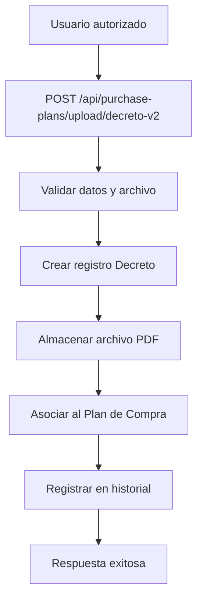
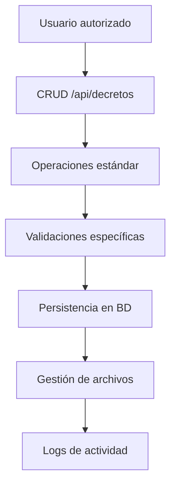

# Sistema de Decretos - Plan de Compras

## 📄 Descripción

Sistema completo para la gestión de decretos asociados a planes de compra, siguiendo el patrón del FormF1. Los decretos son documentos oficiales de aprobación que se almacenan como archivos PDF con metadatos específicos.

## 🏗️ Estructura del Sistema

### **Modelo Decreto**
```php
// Tabla: decretos
- id (Primary Key)
- name (nombre descriptivo - generado automáticamente)
- description (descripción del decreto - generada automáticamente)
- url (URL del archivo almacenado)
- type (tipo MIME del archivo)
- size (tamaño en bytes)
- extension (extensión del archivo)
- created_by/updated_by (usuarios responsables)

// Campos DEPRECATED (no se usan):
- numero_decreto (NULL)
- fecha_decreto (NULL)
```

### **Relación con Planes de Compra**
- **Relación 1:1**: Un plan de compra puede tener un único decreto
- **Campo en `purchase_plans`**: `decreto_id` (foreign key única hacia `decretos`)

## 🔄 Endpoints de la API

### **CRUD Completo de Decretos**
```http
GET    /api/decretos                    # Listar decretos
POST   /api/decretos                    # Crear decreto
GET    /api/decretos/{id}               # Ver decreto específico
PUT    /api/decretos/{id}               # Actualizar decreto
DELETE /api/decretos/{id}               # Eliminar decreto
GET    /api/decretos/{id}/download      # Descargar archivo
```

### **Upload específico para Planes de Compra**
```http
POST   /api/purchase-plans/upload/decreto       # Upload original (legacy)
POST   /api/purchase-plans/upload/decreto-v2    # Upload mejorado (nuevo)
```

## 📝 Validaciones de Input

### **UploadDecretoRequest (via Plan de Compra)**
```php
Campos requeridos:
- 'file' => 'required|file|mimes:pdf|max:5120'  // Máximo 5MB
- 'token_purchase_plan' => 'required|exists:purchase_plans,token'
```

### **DecretoRequest (CREATE)**
```php
Campos requeridos:
- 'file' => 'required|file|mimes:pdf|max:5120'  // Máximo 5MB
- 'purchase_plan_id' => 'required|exists:purchase_plans,id'
```

### **UpdateDecretoRequest (UPDATE)**
```php
Campos requeridos:
- 'file' => 'required|file|mimes:pdf|max:5120'  // Máximo 5MB
// Nota: No requiere purchase_plan_id porque el decreto ya está asociado
```

## 🔐 Sistema de Permisos

### **Permisos Necesarios**
```php
// Upload de decretos
'purchase_plans.create'

// CRUD de decretos
'decretos.list'     # Listar decretos
'decretos.create'   # Crear decretos
'decretos.edit'     # Editar decretos
'decretos.delete'   # Eliminar decretos
'decretos.view'     # Ver detalles
'decretos.download' # Descargar archivos
```

### **Roles con Acceso para SUBIR Decretos**
- **Administrador del Sistema**: Acceso completo (crear, editar, eliminar, subir)
- **Administrador Municipal**: Acceso completo (crear, editar, eliminar, subir)
- **Director**: Puede subir, crear, editar y ver decretos
- **Subrogante de Director**: Puede subir, crear, editar y ver decretos

### **Roles SIN Acceso para Subir Decretos**
- **Secretaría Comunal de Planificación**: Solo visualización (sin upload)
- **Visador**: Sin acceso a decretos
- **Jefatura**: Sin acceso a decretos
- **Subrogante de Jefatura**: Sin acceso a decretos
- **Encargado de Presupuestos**: Sin acceso a decretos
- **Subrogante Encargado de Presupuestos**: Sin acceso a decretos

## 📁 Gestión de Archivos

### **Almacenamiento**
```php
Directorio: storage/app/public/uploads/decretos/
Formato nombre: {slug-nombre}-{uniqid}.pdf
URL pública: {app_url}/storage/uploads/decretos/{archivo}
```

### **Características**
- **Formato único**: Solo archivos PDF
- **Tamaño máximo**: 5MB
- **Datos mínimos**: Solo archivo y plan de compra asociado
- **Eliminación automática**: Se elimina el archivo físico al borrar el registro
- **Nombres únicos**: Generación automática con slug + uniqid

## 📊 Respuesta de API

### **Estructura del Resource**
```json
{
  "id": 1,
  "name": "2024-01-15 12:30 - Alcaldía - Decreto",
  "description": "Decreto para el plan de compra de la dirección Alcaldía",
  "url": "http://localhost/storage/uploads/decretos/decreto-abc123.pdf",
  "type": "application/pdf",
  "size": 1024000,
  "extension": "pdf",
  "created_by": {
    "id": 1,
    "name": "Juan Pérez",
    "email": "juan.perez@municipio.cl"
  },
  "purchase_plan": {
    "id": 1,
    "name": "Plan de Compra 2024 - Alcaldía",
    "token": "abc123xyz789",
    "year": 2024
  },
  "created_at": "2024-01-15 12:30:00",
  "updated_at": "2024-01-15 12:30:00"
}
```

## 🔄 Flujo de Trabajo

### **1. Upload via Plan de Compra**


### **2. CRUD Independiente**


## 📈 Características Destacadas

### **1. Sistema Simplificado**
- **Datos mínimos**: Solo archivo PDF y plan de compra asociado
- **Nombres automáticos**: Generación automática con fecha y dirección
- **Sin metadatos complejos**: Enfoque en lo esencial

### **2. Validaciones Robustas**
- **Solo PDFs**: Validación estricta de tipo MIME
- **Tamaño controlado**: Límite de 5MB
- **Integridad**: Asociación obligatoria con planes de compra

### **3. Integración Completa**
- **Historial automático**: Registro de todas las acciones
- **Logs de actividad**: Auditoría completa
- **Relaciones consistentes**: Con planes de compra

### **4. Gestión de Archivos**
- **Eliminación segura**: Cleanup automático de archivos
- **URLs públicas**: Acceso directo vía HTTP
- **Nombres únicos**: Sin conflictos de archivos

## 🛠️ Comandos de Instalación

### **1. Ejecutar Migraciones**
```bash
php artisan migrate
```

### **2. Instalar Permisos de Decretos**
```bash
php artisan decreto:install-permissions
```

### **3. Limpiar Permisos de Roles No Autorizados**
```bash
php artisan decreto:clean-permissions
```

### **4. Verificar Permisos**
```bash
php artisan permission:list | grep decreto
```

### **5. Crear Storage Link (si no existe)**
```bash
php artisan storage:link
```

## 🧪 Testing

### **Endpoints a Probar**
```bash
# Upload de decreto (SIMPLIFICADO)
POST /api/purchase-plans/upload/decreto-v2
Content-Type: multipart/form-data
{
  "file": archivo.pdf,               # Máximo 5MB
  "token_purchase_plan": "abc123"    # Solo estos 2 campos
}

# CRUD independiente
POST /api/decretos
{
  "file": archivo.pdf,
  "purchase_plan_id": 1
}

# Actualizar decreto (solo nuevo archivo)
PUT /api/decretos/1
{
  "file": nuevo_archivo.pdf
}

# Listar decretos
GET /api/decretos?q=decreto&show=10

# Descargar decreto
GET /api/decretos/1/download
```

## 🎯 Ventajas del Nuevo Sistema

### **1. Consistencia**
- **Patrón unificado**: Igual al sistema FormF1
- **Validaciones coherentes**: Reglas específicas por tipo
- **Nomenclatura clara**: Decretos vs archivos genéricos

### **2. Funcionalidad Simplificada**
- **Datos esenciales**: Solo lo necesario para funcionar
- **Búsqueda básica**: Por nombre y descripción
- **CRUD completo**: Operaciones independientes
- **Fácil uso**: Mínima complejidad para el usuario

### **3. Mantenibilidad**
- **Separación clara**: Decretos vs archivos generales
- **Servicios específicos**: Lógica encapsulada
- **Testing facilitado**: Endpoints específicos

## 🚀 Próximos Pasos

1. **Migración de datos**: Mover decretos existentes desde `files` a `decretos`
2. **Actualizar permisos**: Añadir permisos específicos de decretos
3. **Frontend**: Implementar interfaces para el nuevo sistema
4. **Notificaciones**: Emails automáticos al subir decretos

---

**Nota**: El sistema mantiene compatibilidad con el endpoint original para no romper integraciones existentes, pero se recomienda migrar al nuevo endpoint `decreto-v2` para acceder a todas las funcionalidades mejoradas. 