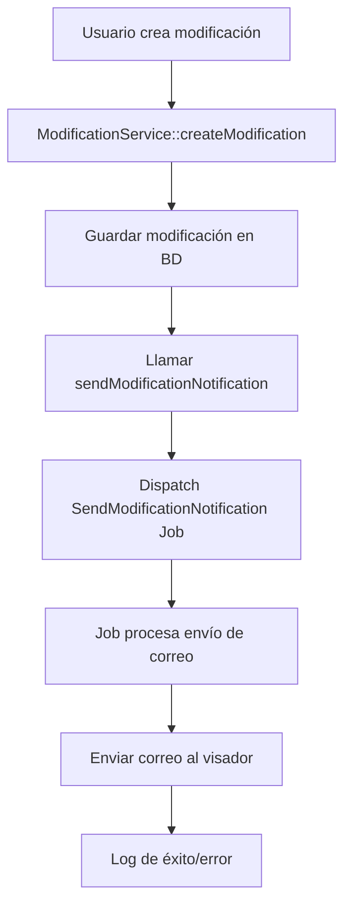

# Sistema de Notificaciones por Correo - Modificaciones

## 📧 Descripción General

El sistema de modificaciones ahora incluye notificaciones automáticas por correo electrónico que se envían al visador cuando se crea una nueva modificación. Esto permite que el visador sea notificado inmediatamente sobre cambios que requieren su revisión y aprobación.

## 🔧 Componentes del Sistema

### 1. **Correo Electrónico** (`ModificationCreated`)
- **Archivo**: `app/Mail/ModificationCreated.php`
- **Vista**: `resources/views/emails/modification-created.blade.php`
- **Función**: Define la estructura y contenido del correo

### 2. **Job Asíncrono** (`SendModificationNotification`)
- **Archivo**: `app/Jobs/SendModificationNotification.php`
- **Función**: Procesa el envío de correo de forma asíncrona
- **Ventajas**: No bloquea la respuesta de la API

### 3. **Servicio de Modificaciones**
- **Archivo**: `app/Services/ModificationService.php`
- **Método**: `sendModificationNotification()`
- **Función**: Dispara la notificación cuando se crea una modificación

## 📨 Flujo de Notificación



## 📋 Contenido del Correo

### **Asunto del Correo:**
```
Nueva Modificación Creada - Plan de Compras
```

### **Información Incluida:**
1. **Detalles de la Modificación:**
   - Nombre de la modificación
   - Descripción
   - Versión (generada automáticamente)
   - Fecha de creación
   - Estado actual
   - Tipo de modificación

2. **Información del Plan de Compra:**
   - Nombre del plan de compra
   - Dirección responsable
   - Año del plan

3. **Información del Creador:**
   - Nombre del usuario que creó la modificación
   - Fecha y hora de creación

4. **Acción Requerida:**
   - Instrucciones para el visador sobre qué hacer

## ⚙️ Configuración

### **Correo del Visador:**
Actualmente configurado para testing:
```php
$visadorEmail = 'oscar.apata@municipalidadarica.cl';
```

### **Para Producción:**
Se recomienda obtener el correo del visador desde:
1. **Configuración del sistema** (archivo .env)
2. **Base de datos** (tabla de usuarios con rol visador)
3. **API externa** (sistema de usuarios)

## 🚀 Implementación

### **1. Crear el Correo:**
```bash
php artisan make:mail ModificationCreated
```

### **2. Crear el Job:**
```bash
php artisan make:job SendModificationNotification
```

### **3. Crear la Vista:**
```bash
# Crear archivo: resources/views/emails/modification-created.blade.php
```

### **4. Configurar Colas (Opcional):**
```bash
# Configurar driver de colas en .env
QUEUE_CONNECTION=database

# Crear tabla de jobs
php artisan queue:table
php artisan migrate

# Procesar colas
php artisan queue:work
```

## 📊 Logs y Monitoreo

### **Logs de Éxito:**
```
[INFO] Correo de notificación de modificación enviado exitosamente
{
    "modification_id": 123,
    "visador_email": "oscar.apata@municipalidadarica.cl"
}
```

### **Logs de Error:**
```
[ERROR] Error enviando correo de notificación de modificación
{
    "modification_id": 123,
    "visador_email": "oscar.apata@municipalidadarica.cl",
    "error": "Connection timeout"
}
```

## 🛡️ Manejo de Errores

### **Estrategia de Fallback:**
1. **Error en Job**: Se registra en logs pero no falla la creación de la modificación
2. **Error de Conexión**: El job puede ser reintentado automáticamente
3. **Correo Inválido**: Se registra el error para investigación

### **Reintentos:**
- El job se puede reintentar hasta 3 veces
- Intervalo de reintento: 5 minutos
- Después de 3 fallos, se marca como fallido

## 🔧 Personalización

### **Cambiar Correo del Visador:**
```php
// En app/Services/ModificationService.php
private function sendModificationNotification(Modification $modification): void
{
    // Obtener correo desde configuración
    $visadorEmail = config('app.visador_email', 'oscar.apata@municipalidadarica.cl');
    
    SendModificationNotification::dispatch($modification, $visadorEmail);
}
```

### **Agregar Múltiples Destinatarios:**
```php
// En el Job
Mail::to($this->visadorEmail)
    ->cc(['admin@municipalidadarica.cl', 'supervisor@municipalidadarica.cl'])
    ->send(new ModificationCreated($modification));
```

### **Personalizar Plantilla:**
Editar `resources/views/emails/modification-created.blade.php` para cambiar:
- Colores y estilos
- Información mostrada
- Texto del mensaje
- Logo de la municipalidad

## 📱 Vista del Correo

El correo incluye:
- **Header**: Logo y título de la municipalidad
- **Contenido**: Detalles organizados en secciones
- **Estados**: Indicadores visuales con colores
- **Footer**: Información legal y de contacto

### **Estados Visuales:**
- 🟡 **Pendiente**: Amarillo
- 🟢 **Activa**: Verde
- 🔵 **Aprobada**: Azul
- 🔴 **Rechazada**: Rojo
- ⚫ **Inactiva**: Gris

## 🔄 Próximas Mejoras

### **Funcionalidades Sugeridas:**
1. **Notificaciones por Estado**: Enviar correos cuando cambie el estado
2. **Recordatorios**: Enviar recordatorios para modificaciones pendientes
3. **Múltiples Visadores**: Soporte para múltiples destinatarios
4. **Plantillas Dinámicas**: Diferentes plantillas según el tipo de modificación
5. **Notificaciones Push**: Integración con notificaciones push
6. **Dashboard de Notificaciones**: Panel para ver historial de envíos

## 🧪 Testing

### **Probar Envío de Correo:**
```php
// En tinker o test
$modification = Modification::find(1);
Mail::to('test@example.com')->send(new ModificationCreated($modification));
```

### **Probar Job:**
```php
// Dispatch del job
SendModificationNotification::dispatch($modification, 'test@example.com');
```

## 📝 Notas Importantes

1. **Configuración de SMTP**: Asegurar que el servidor de correo esté configurado
2. **Colas**: Para producción, usar colas para no bloquear la API
3. **Rate Limiting**: Considerar límites de envío del servidor de correo
4. **Spam**: Asegurar que los correos no sean marcados como spam
5. **Privacidad**: No incluir información sensible en los correos
6. **Backup**: Mantener logs de envío para auditoría 