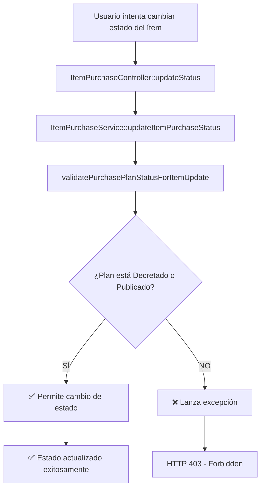

# 🔒 Validación de Estados de Ítems de Compra

## Descripción
Se ha implementado una validación que **restringe el cambio de estado de los ítems de compra** únicamente cuando el **Plan de Compra** asociado esté en los estados:
- **Decretado** (ID: 6)
- **Publicado** (ID: 7)

## 🎯 Objetivo
Garantizar que los ítems de compra solo puedan cambiar su estado cuando el plan al que pertenecen esté oficialmente aprobado y listo para ejecución.

## ⚙️ Implementación

### 1. **Servicio Modificado**
**Archivo**: `app/Services/ItemPurchaseService.php`

**Método**: `updateItemPurchaseStatus()`
- ✅ Agregada validación previa al cambio de estado
- ✅ Verifica el estado actual del plan de compra
- ✅ Lanza excepción específica si el estado no es válido

**Método nuevo**: `validatePurchasePlanStatusForItemUpdate()`
- 🔍 Carga las relaciones necesarias: `project.purchasePlan.currentStatus.status`
- 🔍 Obtiene el estado actual del plan de compra
- ✅ Valida que el estado sea Decretado (6) o Publicado (7)
- ❌ Lanza excepción descriptiva si no cumple la condición

### 2. **Controlador Mejorado**
**Archivo**: `app/Http/Controllers/ItemPurchaseController.php`

**Método**: `updateStatus()`
- ✅ Manejo específico de excepciones de validación
- ✅ Respuesta HTTP 403 (Forbidden) para estados no válidos
- ✅ Incluye `error_type` para mejor manejo en frontend

### 3. **Estados Válidos**
```php
// Solo estos estados del plan permiten cambios en ítems:
$validStates = [6, 7]; // Decretado, Publicado
```

## 📋 Flujo de Validación



## 🚫 Mensajes de Error

### Error de Validación
```json
{
  "message": "No es posible cambiar el estado de los ítems. El plan de compra debe estar en estado 'Decretado' o 'Publicado' para permitir cambios de estado en los ítems. Estado actual del plan: 'Borrador'",
  "error_type": "purchase_plan_status_validation"
}
```

### Código HTTP
- **403 Forbidden**: Cuando el plan no está en estado válido
- **200 OK**: Cuando el cambio es exitoso

## 🔗 Endpoint Afectado

```http
PUT /api/item-purchases/{id}/status
Content-Type: application/json
Authorization: Bearer {token}

{
  "status_item_purchase_id": 2
}
```

## 🧪 Comando de Prueba

Se ha creado un comando para probar la funcionalidad:

```bash
php artisan test:item-status-validation {item_id} {new_status_id}
```

**Ejemplo de uso:**
```bash
php artisan test:item-status-validation 1 2
```

### Salida del Comando
```
🧪 Probando validación de cambio de estado...
Item ID: 1
Nuevo estado ID: 2

📋 Información del ítem:
  - Producto/Servicio: Laptops para oficina
  - Estado actual: Solicitado
  - Plan de compra: Plan de Compra 2025 - Dirección Municipal
  - Estado del plan: Borrador (ID: 1)
  ⚠️  Estado NO válido para cambios. Debe ser 'Decretado' (6) o 'Publicado' (7)

🔄 Intentando cambiar estado...
❌ Error al cambiar estado:
  No es posible cambiar el estado de los ítems. El plan de compra debe estar en estado 'Decretado' o 'Publicado' para permitir cambios de estado en los ítems. Estado actual del plan: 'Borrador'

💡 Esto es correcto: La validación está funcionando como se esperaba.
   Solo se pueden cambiar estados cuando el plan está 'Decretado' o 'Publicado'.
```

## 🔄 Estados del Plan de Compra

| ID | Estado | ¿Permite cambios en ítems? |
|----|--------|----------------------------|
| 1  | Borrador | ❌ NO |
| 2  | Para aprobación | ❌ NO |
| 3  | Visado | ❌ NO |
| 4  | Aprobado para decretar | ❌ NO |
| 5  | Rechazado | ❌ NO |
| 6  | **Decretado** | ✅ **SÍ** |
| 7  | **Publicado** | ✅ **SÍ** |

## 🎯 Beneficios

1. **Control de Integridad**: Solo se pueden modificar ítems cuando el plan está oficialmente aprobado
2. **Seguridad**: Previene cambios accidentales en estados preliminares
3. **Trazabilidad**: Clara separación entre etapas de planificación y ejecución
4. **Consistencia**: Todos los ítems siguen la misma lógica de validación

## 📱 Integración Frontend

El frontend puede verificar el estado del plan y:
- **Deshabilitar botones** de cambio de estado cuando el plan no esté en estado válido
- **Mostrar mensajes informativos** sobre por qué no se pueden hacer cambios
- **Manejar el error 403** para mostrar notificaciones adecuadas al usuario

```javascript
// Ejemplo de manejo en el frontend
if (purchasePlan.current_status.status.id === 6 || purchasePlan.current_status.status.id === 7) {
  // Habilitar cambio de estados de ítems
} else {
  // Deshabilitar y mostrar mensaje informativo
}
```

## ✅ Resumen

La validación está **completamente implementada** y **funcionando**. Los ítems de compra solo pueden cambiar de estado cuando el plan de compra esté en estado **"Decretado"** o **"Publicado"**, garantizando la integridad del proceso de planificación y ejecución de compras. 