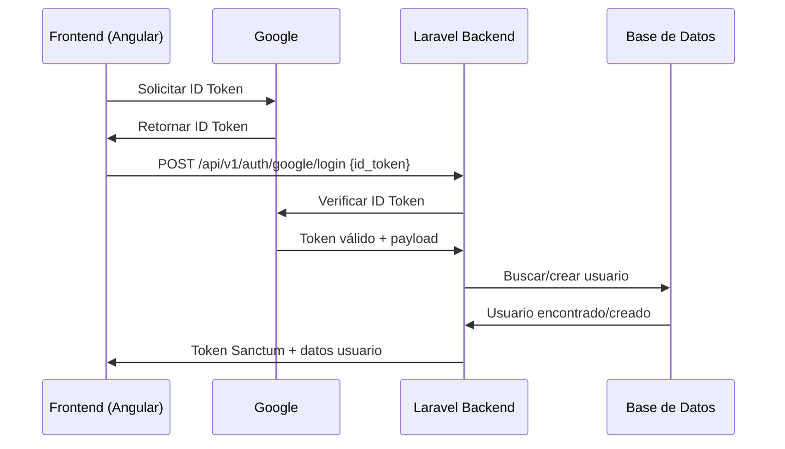

# Sistema de Autenticación con Google OAuth

## Descripción General

Este documento describe la implementación completa del sistema de autenticación con Google OAuth en el sistema Leykarin. El sistema permite a los usuarios autenticarse usando tanto credenciales tradicionales (RUT/contraseña) como Google OAuth, proporcionando una experiencia de usuario flexible y segura.

## Características Principales

### 🔐 Autenticación Dual
- **Login Tradicional**: RUT y contraseña con soporte para 2FA por email
- **Google OAuth**: Autenticación con cuenta de Google usando ID Token
- **Vinculación de Cuentas**: Los usuarios pueden vincular/desvincular sus cuentas de Google

### 🏢 Restricción de Dominio Corporativo (Opcional)
- Configuración flexible para restringir acceso a dominios específicos o permitir todos
- Validación automática del dominio `hd` (hosted domain) en el token de Google
- Soporte para organizaciones que usan Google Workspace
- Permite cuentas personales de Gmail cuando se configura `GOOGLE_ALLOWED_DOMAIN=*`

### 🛡️ Seguridad Avanzada
- Verificación completa de ID Token usando la librería oficial de Google
- Validación de audiencia, emisor y expiración del token
- Logging completo de actividades de autenticación
- Integración con el sistema de logs de seguridad existente

### 👥 Gestión de Usuarios
- Auto-registro opcional (configurable)
- Solo usuarios pre-registrados pueden acceder (por defecto)
- Preservación de roles y permisos existentes
- Compatibilidad con tipos de usuario organizacionales (IMA, DISAM, DEMUCE)

## Arquitectura del Sistema

### Componentes Principales

1. **GoogleAuthService**: Servicio principal para manejo de Google OAuth
2. **GoogleLoginController**: Controlador para endpoints de autenticación
3. **User Model**: Modelo extendido con campos de Google OAuth
4. **Migración**: Campos adicionales en tabla users
5. **Rutas API**: Endpoints públicos y protegidos

### Flujo de Autenticación



## Configuración

### 1. Variables de Entorno

Agregar al archivo `.env`:

```env
# Claves de Google OAuth (obtener de Google Cloud Console)
GOOGLE_CLIENT_ID=your-google-client-id.apps.googleusercontent.com
GOOGLE_CLIENT_SECRET=your-google-client-secret

# Configuración de dominio corporativo (opcional)
# Opciones:
# - municipalidadarica.cl (solo ese dominio)
# - * (todos los dominios, incluye Gmail personal)
# - vacío (todos los dominios)
GOOGLE_ALLOWED_DOMAIN=*

# Configuración de seguridad OAuth
GOOGLE_OAUTH_ENABLED=true
GOOGLE_OAUTH_AUTO_REGISTER=false
GOOGLE_OAUTH_DEFAULT_ROLE=user
```

### 2. Google Cloud Console

#### Configurar Proyecto GCP:
1. Ir a [Google Cloud Console](https://console.cloud.google.com/)
2. Crear o seleccionar proyecto
3. Habilitar Google Identity Services API

#### Configurar Pantalla de Consentimiento:
1. Ir a **APIs y Servicios > Pantalla de Consentimiento OAuth**
2. Configurar información de la aplicación
3. Agregar dominios autorizados

#### Crear Credenciales:
1. Ir a **APIs y Servicios > Credenciales**
2. Crear **ID de cliente de OAuth 2.0**
3. Tipo: **Aplicación Web**
4. **Orígenes JavaScript autorizados**:
   - `https://your-domain.com` (producción)
   - `http://localhost:4200` (desarrollo)

### 3. Instalación de Dependencias

```bash
# Instalar librería de Google (si no está instalada)
composer require google/apiclient:^2.15.0
```

### 4. Ejecutar Migración

```bash
php artisan migrate
```

## Endpoints API

### Endpoints Públicos

#### `POST /api/v1/auth/google/login`
Autentica usuario con Google OAuth.

**Request:**
```json
{
  "id_token": "eyJhbGciOiJSUzI1NiIs..."
}
```

**Response (Éxito):**
```json
{
  "message": "Bienvenido(a) al sistema Juan Pérez",
  "token": "1|abc123...",
  "token_type": "Bearer",
  "user": {
    "id": 1,
    "name": "Juan",
    "email": "juan.perez@municipalidadarica.cl",
    "auth_provider": "google",
    "roles": [...],
    "permissions": [...]
  },
  "auth_provider": "google"
}
```

**Response (Error):**
```json
{
  "message": "Dominio de correo no autorizado. Solo se permite el acceso a municipalidadarica.cl"
}
```

#### `GET /api/v1/auth/google/config`
Obtiene configuración de Google OAuth para el frontend.

**Response:**
```json
{
  "google_oauth": {
    "client_id": "123456789-abc.apps.googleusercontent.com",
    "enabled": true,
    "allowed_domain": "municipalidadarica.cl",
    "auto_register": false
  }
}
```

### Endpoints Protegidos (requieren autenticación)

#### `GET /api/v1/auth/google/status`
Obtiene estado de vinculación con Google del usuario autenticado.

**Response:**
```json
{
  "is_google_linked": true,
  "google_email": "juan.perez@gmail.com",
  "google_name": "Juan Pérez",
  "google_avatar": "https://lh3.googleusercontent.com/...",
  "google_verified_at": "2025-01-27T21:30:00.000000Z",
  "auth_provider": "google",
  "can_unlink": true
}
```

#### `POST /api/v1/auth/google/link`
Vincula cuenta existente con Google OAuth.

**Request:**
```json
{
  "id_token": "eyJhbGciOiJSUzI1NiIs..."
}
```

#### `POST /api/v1/auth/google/unlink`
Desvincula cuenta de Google OAuth.

**Response:**
```json
{
  "message": "Cuenta de Google desvinculada exitosamente.",
  "user": {...}
}
```

## Integración Frontend (Angular)

### 1. Instalación

```bash
npm install google-auth-library
```

### 2. Configuración en index.html

```html
<script src="https://accounts.google.com/gsi/client" async defer></script>
```

### 3. Componente de Login

```typescript
import { Component, OnInit, NgZone } from '@angular/core';
import { HttpClient } from '@angular/common/http';

@Component({
  selector: 'app-google-login',
  template: `<div id="google-btn-container"></div>`
})
export class GoogleLoginComponent implements OnInit {
  
  constructor(
    private http: HttpClient,
    private zone: NgZone
  ) {}

  ngOnInit(): void {
    this.initializeGoogleSignIn();
  }

  private initializeGoogleSignIn(): void {
    if (typeof google === 'undefined') {
      setTimeout(() => this.initializeGoogleSignIn(), 100);
      return;
    }

    google.accounts.id.initialize({
      client_id: 'YOUR_GOOGLE_CLIENT_ID',
      callback: (response: any) => this.handleCredentialResponse(response)
    });

    google.accounts.id.renderButton(
      document.getElementById('google-btn-container'),
      { theme: 'outline', size: 'large' }
    );
  }

  private handleCredentialResponse(response: any): void {
    this.zone.run(() => {
      this.http.post('/api/v1/auth/google/login', {
        id_token: response.credential
      }).subscribe({
        next: (res: any) => {
          localStorage.setItem('token', res.token);
          // Redirigir al dashboard
        },
        error: (err) => {
          console.error('Login fallido:', err);
        }
      });
    });
  }
}
```

## Casos de Uso

### 1. Usuario Nuevo con Google
1. Usuario hace clic en "Iniciar sesión con Google"
2. Google retorna ID Token
3. Sistema verifica token y dominio
4. Si `auto_register=false`: Error "Usuario no registrado"
5. Si `auto_register=true`: Se crea usuario automáticamente

### 2. Usuario Existente sin Google
1. Usuario tiene cuenta tradicional (RUT/contraseña)
2. Puede vincular su cuenta con Google usando endpoint `/link`
3. Después puede usar ambos métodos de autenticación

### 3. Usuario con Cuenta Vinculada
1. Puede usar login tradicional o Google OAuth
2. Información de Google se actualiza en cada login
3. Puede desvincular cuenta si tiene contraseña configurada

### 4. Restricción de Dominio (Configurable)

**Opción A: Dominio Específico**
1. Solo usuarios con email `@municipalidadarica.cl` pueden acceder
2. Validación automática del claim `hd` en el token
3. Error claro si dominio no está autorizado

**Opción B: Todos los Dominios** (configurar `GOOGLE_ALLOWED_DOMAIN=*`)
1. Permite cuentas de Gmail personales (@gmail.com)
2. Permite cuentas de otros dominios corporativos
3. Permite cuentas de Outlook, Yahoo, etc.
4. Útil para sistemas públicos o con usuarios externos

## Seguridad

### Validaciones Implementadas

1. **Verificación de Token**:
   - Firma digital del token
   - Audiencia (aud) correcta
   - Emisor (iss) válido
   - Token no expirado

2. **Validación de Dominio**:
   - Claim `hd` (hosted domain) presente
   - Dominio coincide con configuración

3. **Gestión de Usuarios**:
   - Solo usuarios pre-registrados (por defecto)
   - Verificación de estado de cuenta activa
   - Preservación de roles y permisos

4. **Logging de Seguridad**:
   - Todos los intentos de login registrados
   - Errores de autenticación loggeados
   - Actividades de vinculación/desvinculación

### Consideraciones de Seguridad

- **Client ID público**: Es seguro exponer el Client ID en el frontend
- **Client Secret**: Solo se usa en el backend, nunca expuesto
- **ID Token**: Válido por tiempo limitado (típicamente 1 hora)
- **Sanctum Token**: Generado después de validación exitosa

## Troubleshooting

### Errores Comunes

#### "ID Token de Google inválido"
- Verificar que Client ID sea correcto
- Confirmar que token no haya expirado
- Revisar configuración en Google Cloud Console

#### "Dominio de correo no autorizado"
- Usuario no pertenece al dominio configurado
- **Solución**: Cambiar `GOOGLE_ALLOWED_DOMAIN=*` para permitir todos los dominios
- O verificar que el usuario tenga cuenta del dominio específico configurado
- Confirmar que usuario tenga cuenta de Google Workspace (si se requiere dominio específico)

#### "Usuario no registrado"
- Usuario no existe en base de datos
- Cambiar `GOOGLE_OAUTH_AUTO_REGISTER=true` o pre-registrar usuario
- Verificar que email coincida exactamente

### Logs Útiles

```bash
# Ver logs de autenticación
tail -f storage/logs/laravel.log | grep "Google"

# Ver logs de seguridad
tail -f storage/logs/security.log
```

## Comandos Útiles

```bash
# Verificar configuración
php artisan config:show services.google

# Limpiar cache de configuración
php artisan config:clear

# Ver rutas de Google OAuth
php artisan route:list | grep google

# Ejecutar migraciones
php artisan migrate

# Rollback migración de Google OAuth
php artisan migrate:rollback --step=1
```

## Mantenimiento

### Actualización de Credenciales
1. Generar nuevas credenciales en Google Cloud Console
2. Actualizar variables de entorno
3. Reiniciar aplicación
4. Verificar funcionamiento

### Monitoreo
- Revisar logs de autenticación regularmente
- Monitorear intentos fallidos
- Verificar que dominios autorizados estén actualizados

### Backup
- Incluir campos de Google OAuth en backups de base de datos
- Documentar configuración de Google Cloud Console
- Mantener registro de Client IDs utilizados

## Soporte

Para problemas relacionados con Google OAuth:

1. **Configuración**: Revisar variables de entorno y config/services.php
2. **Tokens**: Verificar en [JWT.io](https://jwt.io) la estructura del token
3. **Google Console**: Confirmar configuración de orígenes autorizados
4. **Logs**: Revisar logs de Laravel para errores específicos

---

**Nota**: Este sistema está diseñado para máxima seguridad y flexibilidad, permitiendo tanto autenticación tradicional como moderna con Google OAuth, manteniendo compatibilidad con el sistema de roles y permisos existente.
